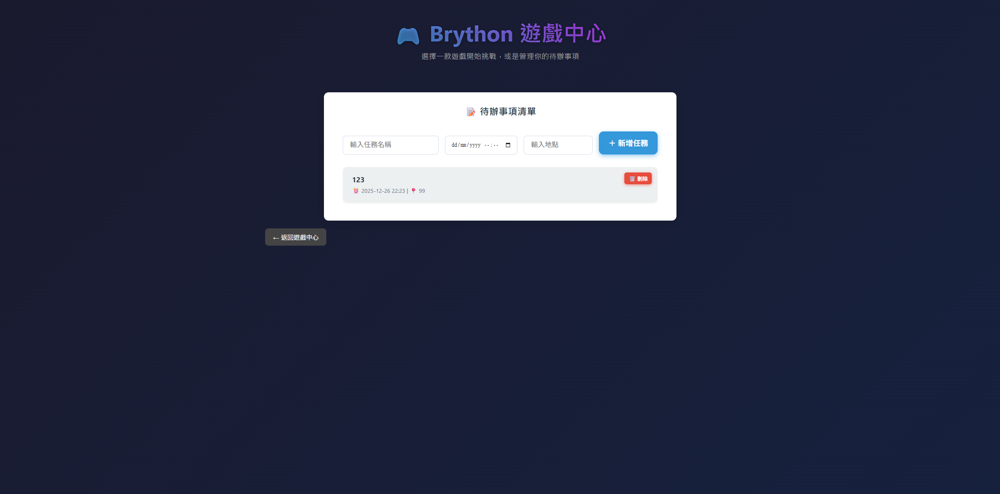

👉[整合遊戲專區](https://41423140.github.io/11/)

### 🎮 Brython 遊戲中心｜綜合簡介

Brython 遊戲中心是一個以 Brython 技術打造的互動式網頁平台，讓 Python 程式能直接在瀏覽器中執行，無需安裝任何軟體即可體驗多樣化內容。

平台內結合多款小遊戲與實用工具，包含射擊、躲避、反應力測試等遊戲，透過滑鼠與鍵盤操作，考驗玩家的專注力、反應速度與操作技巧。

此外，系統也整合了待辦事項管理功能，支援任務紀錄、時間排序與提醒通知，讓使用者在娛樂之餘，也能有效安排日常行程。

整體介面設計簡潔現代，操作直覺，適合作為程式學習展示、作品發表或休閒娛樂的平台。

### 🎮 Brython 遊戲中心｜各類型遊戲講解

📝 待辦事項管理

提供基本且實用的任務管理功能，使用者可新增任務名稱、時間與地點，系統會自動排序並標示今日任務，同時支援瀏覽器通知提醒，協助使用者有效安排日常行程。

🎯 星際射擊戰

玩家使用鍵盤移動角色，搭配滑鼠瞄準射擊，對抗不斷出現的敵人。遊戲包含升級與道具系統，隨著分數提升，敵人數量與難度也會逐步增加，考驗操作與反應能力。

🏃 躲避球挑戰

玩家控制綠色角色閃避畫面中的紅色障礙物，並收集道具以獲得額外分數。遊戲會隨時間提升速度與難度，強調專注力與即時反應。

🟥 極速點擊方塊

在限定時間內點擊隨機出現的紅色方塊，以獲得最高分數。玩法簡單直覺，適合快速體驗，主要測試玩家的反應速度與點擊準確度。

🚀 星際戰爭

玩家駕駛太空飛船在星空背景中移動，閃避並撞擊敵人。遊戲設有分數、生命值與關卡系統，隨著進度推進，遊戲節奏與挑戰性逐漸提高。

👉[詳細介紹影片](https://youtu.be/Gd46A5Uu97A)

### 🎮 Brython 遊戲中心｜心得

一開始只是嘗試製作幾個簡單的小遊戲，作為練習與實驗用途，目標並不大，只希望能熟悉遊戲邏輯與基本互動的實作方式。

在製作的過程中，逐漸發現開發遊戲其實相當有趣，從角色移動、碰撞判定到分數與畫面回饋，每完成一個功能都能立刻看到成果，讓人產生持續嘗試與改進的動力。

隨著經驗累積，完成的遊戲數量也越來越多，類型逐漸豐富，從反應力測試到動作與生存類型皆有所嘗試。這時也開始思考，若能將這些零散的作品整合在同一個平台中，會讓整體更完整。

因此，最後將所有遊戲統整到同一個介面，形成現在的遊戲中心，不僅方便管理與展示，也讓使用者能在同一個平台中體驗多種不同玩法，成為一個兼具學習成果與娛樂性的作品。
